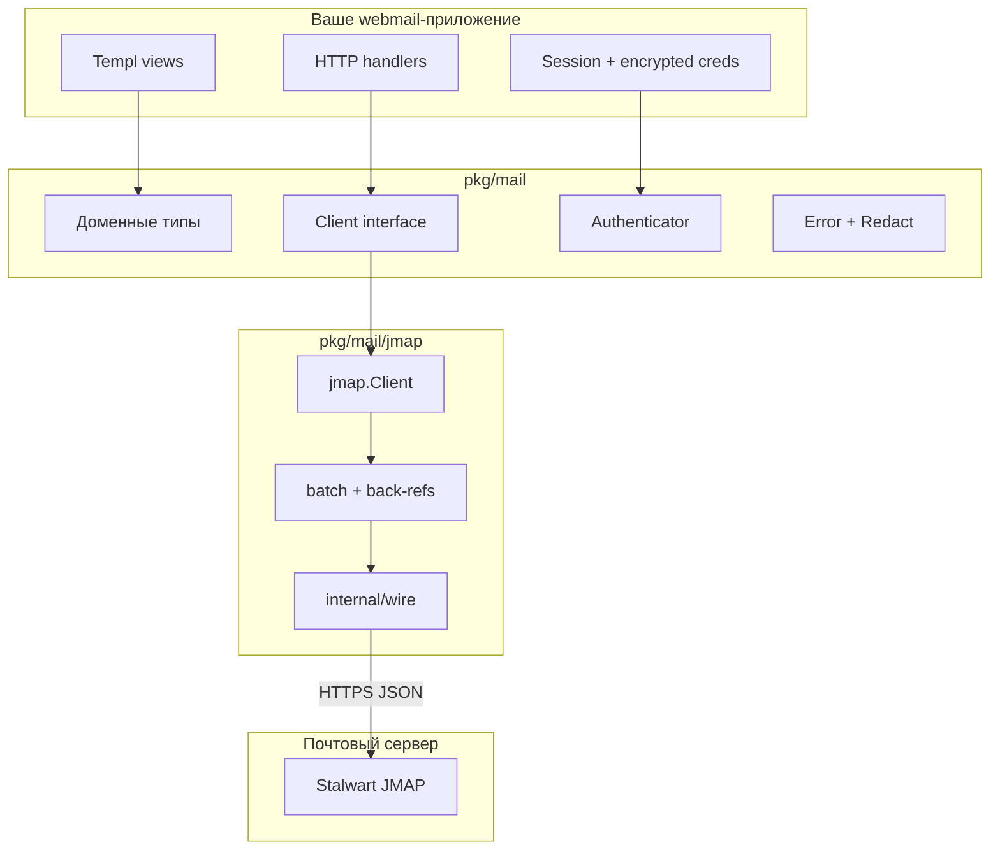

# 2. Архитектура

[← Введение](01-vvedenie.md) · [Оглавление](INDEX.md) · [Далее: Доменные типы →](03-domennye-tipy.md)

---

## Общая схема



---

## Слои ответственности

| Слой | Пакет / путь | Ответственность |
|------|--------------|-----------------|
| **Домен** | `pkg/mail` (корень) | Что такое письмо, папка, черновик — без протокола |
| **Контракт** | `client.go` | Что клиент **обязан** уметь |
| **Опции** | `Threader`, `Pusher`, `Searcher` | Что клиент **может** уметь (type assertion) |
| **Транспорт** | `pkg/mail/jmap` | Как доменные операции мапятся на JMAP |
| **Wire** | `jmap/internal/wire` | Сырой JSON RFC 8620/8621 (internal) |
| **Приложение** | ваш repo | HTTP, UI, сессии, кэш |

---

## Контракт Client — центр архитектуры

Все транспорты реализуют один интерфейс:

```go
type Client interface {
    Mailboxes(ctx context.Context) ([]Mailbox, error)
    Messages(ctx context.Context, mailboxID string, opts ListOptions) (Page[MessageSummary], error)
    Message(ctx context.Context, id string) (*Message, error)
    Attachment(ctx context.Context, messageID, partID string) (io.ReadCloser, AttachmentInfo, error)
    SetFlags(ctx context.Context, ids []string, add, remove FlagSet) error
    Move(ctx context.Context, ids []string, destMailboxID string) error
    Delete(ctx context.Context, ids []string) error
    Send(ctx context.Context, draft Draft) (*SendResult, error)
    Capabilities() Capabilities
    Close() error
}
```

**Ключевые свойства:**

- **Concurrent-safe** — один `jmap.Client` можно вызывать из нескольких goroutine (mutex только на session snapshot).
- **Opaque IDs** — `id`, `mailboxID` — непрозрачные строки; не парсить, не строить UI-логику на формате.
- **Context everywhere** — каждый вызов принимает `context.Context` для отмены и таймаутов.

---

## Опциональные возможности (не в Client)

```go
if t, ok := client.(mail.Threader); ok {
    msgs, _ := t.Thread(ctx, threadID)
}

if p, ok := client.(mail.Pusher); ok {
    ch, _ := p.Watch(ctx)
    // ...
}

if s, ok := client.(mail.Searcher); ok {
    page, _ := s.Search(ctx, query, opts)
}
```

`jmap.Client` реализует **все четыре** интерфейса. Будущий IMAP-транспорт может не реализовать `Searcher` или `Pusher`.

Проверяйте также `client.Capabilities()`:

```go
caps := client.Capabilities()
// caps.Threads, caps.Push, caps.Search — bool
// caps.MaxUploadSize, caps.MaxMessageSize — int64
```

---

## Жизненный цикл jmap.Client

```text
jmap.New(ctx, opts)
    │
    ├─► GET SessionURL (.well-known/jmap)
    │       проверка capabilities: core + mail
    │       выбор accountId (primary mail)
    │
    ├─► операции через POST apiUrl
    │       batch([]methodCalls...)
    │
    └─► Close()
            http.Client.CloseIdleConnections()
```

JMAP **stateless**: нет постоянного TCP-сокета как у IMAP. «Сессия» — это JSON-ресурс с URL-ами и capabilities, закэшированный в `Client`.

---

## Батчинг и back-references (важно для производительности)

Типичный список inbox = **один HTTP-запрос**:

```text
methodCalls: [
  ["Email/query",  { filter, sort, limit },  "c0"],
  ["Email/get",    { "#ids": { resultOf: "c0", path: "/ids" } }, "c1"]
]
```

`Messages` и `Search` в jmap делают это автоматически. Это снижает latency и соответствует столпу «без лишних запросов».

Отправка письма = один batch:

```text
Email/set          → создать draft в папке Drafts
EmailSubmission/set → отправить, onSuccessUpdateEmail → Sent
```

---

## Поток данных: чтение письма

```text
Messages(mailboxID)
    → []MessageSummary (subject, preview, flags — без тела)

Message(id)
    → Message (+ TextBody, HTMLBody, []AttachmentInfo)

Attachment(messageID, partID)
    → io.ReadCloser (stream, не буфер в памяти pkg/mail)
```

**HTMLBody** — обычная `string`, **не** `template.HTML`. Санитизация — на стороне рендерера (iframe sandbox или HTML cleaner в приложении).

---

## Поток данных: отправка

```text
Draft { From, To, Subject, TextBody, Attachments[] }
    │
    ├─► для каждого Attachment: Open() → upload blob (stream)
    ├─► Email/set: create в Drafts
    ├─► EmailSubmission/set: identityId + emailId "#draft"
    └─► onSuccess: mailbox Drafts→Sent, keywords $draft→$seen
```

---

## internal/wire — почему internal

JSON-структуры JMAP (`Invocation`, `Session`, `wire.Email`) **не экспортируются** в public API приложения. Это позволяет:

- менять wire-слой без breaking change для webmail;
- при необходимости заменить реализацию JMAP, сохранив `mail.Client`.

---

## Roadmap транспортов

| Транспорт | Статус | Серверы |
|-----------|--------|---------|
| `pkg/mail/jmap` | **Реализован** | Stalwart (ref), любой RFC 8621 |
| `pkg/mail/imap` + `smtp` | ADR 0005 (отложено) | maddy, Dovecot, Gmail IMAP |

Контракт `Client` спроектирован так, чтобы IMAP мапил `mailbox+UIDVALIDITY+UID` в одну opaque string ID.

---

[← Введение](01-vvedenie.md) · [Оглавление](INDEX.md) · [Далее: Доменные типы →](03-domennye-tipy.md)
